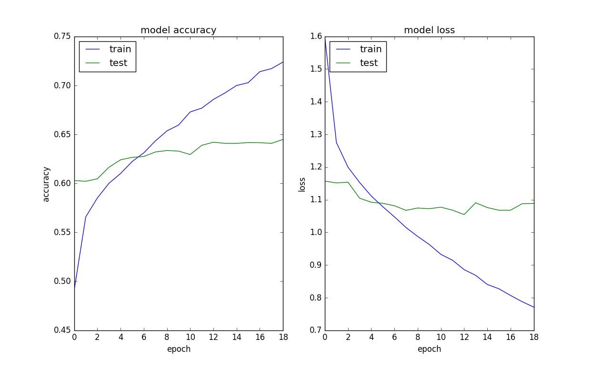
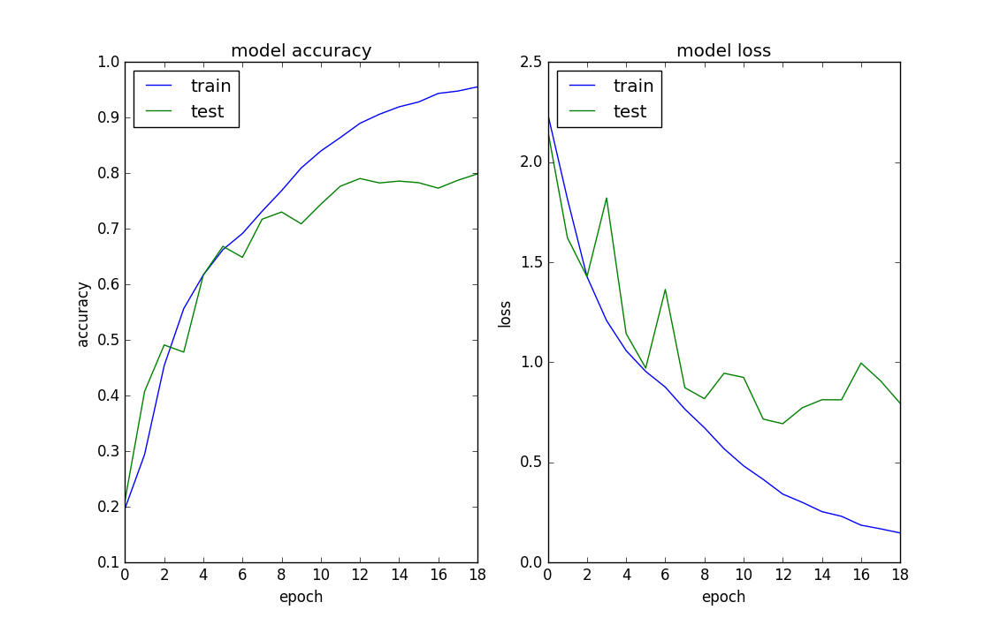
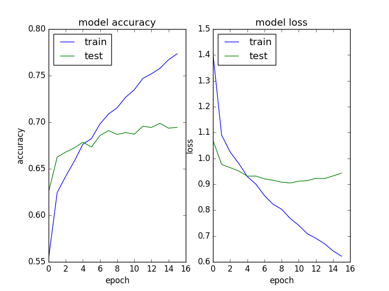
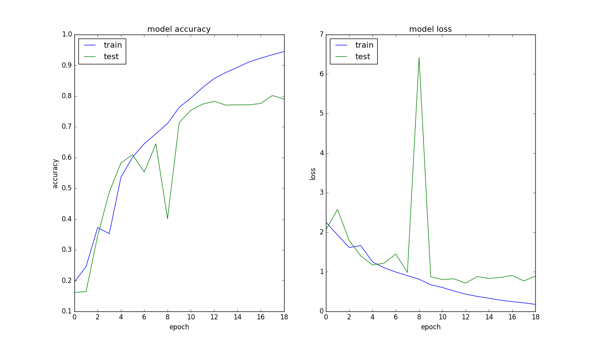

##Using VGG16 to classify cifar-10 by Transfer Learning

### Introduction
I am playing with 
### Steps
The original input size of VGG16 is 224\*224, but the CIFAR image size:32\*32. I am not going to resize the CIFAR image size to 224\*224. In order to do so, 
1) I need remove the fully connected layer of VGG16 and only reserve the conv layers.
2) append my own fully connected layers to the top.
3) Retain the VGG16 weight from change.
4) Train my own fc layers to classify the image.


In the conv3 sublayer, the size is not change. The pooling layer descrease the size in half. If the input size is 32*32, the output of pool5 will be 1*1

###Test result

#### Fixed VGG16 conv layer
The validation accuracy is very low about 0.64.


#### Base model is also trained
The validation accuracy is about 0.8


#### Fixed VGG16 conv layer with input preprocessing 


#### Base model is also trained with input preprocessing


#### Conclusion
The transfer training result is not good currently. The fine tuning result is better than fixing VGG conv layer weights. Maybe the reason is the input size of image is different from the original VGG input size.

### Issues during debug
#### labels should be convert to categorical values
when calling cifar10.load_data to load data
```
(X_train, y_train), (_, _) = cifar10.load_data()
```
The y_train is an vector in shape (50000, ), we cannot provide it to model.fit directly. np_utils.to_categorical should be called to convert it first.

####Preprocessing of X_train
The X_train should be preprocessed first by calling
keras.applications.vgg16.preprocess_input.